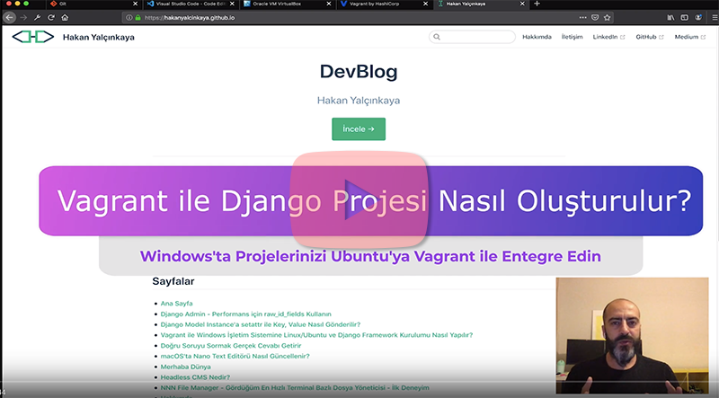

# Python ve Django Eğitimi Notları

## KÜGİM'de 20 Nisan 2019 Tarihinde Başlayan Python ve Django Eğitimi Notlarını İçerir

### Vagrant ile Windows İşletim Sistemine Linux/Ubuntu ve Django Framework Kurulumu Nasıl Yapılır?

[Izlemek icin tikla..](https://www.youtube.com/watch?v=NFL6tMnm1vw)

### Eğitim İçeriği:
- [str(Metinsel Islemler) ile Calismak](python/str_ile_calismak.py)
- [int ile Calismak](python/int_ile_calismak.py)

> Not: Bu kisimdaki bilgiler yuklenmeye devam edilecek

### Bootstrap ile Hazirlanan Web Sitesi
Hazirlanan sitede Bootstrap kullanildi ve PHP ile site parcalandi. Bu islem Django Templates'deki **extends** ve **include** icin on hazirlik olarak yapildi
- [web sitesinin kodlarini icnelemek icin tikla](simple_web_site_with_php_include/index.php)

### Django - Bootstrap ile Hazirlanan Ilk Sitenin Implamantasyonu
Bootstrap ile hazirladigimiz web sitesinin Django'nun View, URL ve sonrasinda Template ozelliklerinin kullanilarak implamantasyonu yapildi.

VirtualEnv ile requierements.txt icindeki paketler yuklendi.

Detaylat icin Makefile dosyasini inceleyebilirsiniz.

[Proje klasorune ulasmak icin tiklayiniz..](lorem_holding_pr/)

### Diğer Konular:
- [ ] Kod Editörü Seçimi
  - [Visual Studio Code](https://code.visualstudio.com/)
  - [Atom](https://atom.io/)
  - [Sublime Text](https://www.sublimetext.com/)
  - [PyCharm(IDE)](https://www.jetbrains.com/pycharm/)
- [ ] Git Client
  - [Sublime Merge](https://www.sublimemerge.com/)
- [ ] Markdown
  - [Typora](https://typora.io/)
- [ ] HTML & CSS
- [ ] Bootstrap
- [ ] UI / UX -> Figma
- [ ] Git Versiyon Kontrol Sistemi
- [ ] GitHub Temel Kullanımı
- [ ] Temel Linux Komutları
